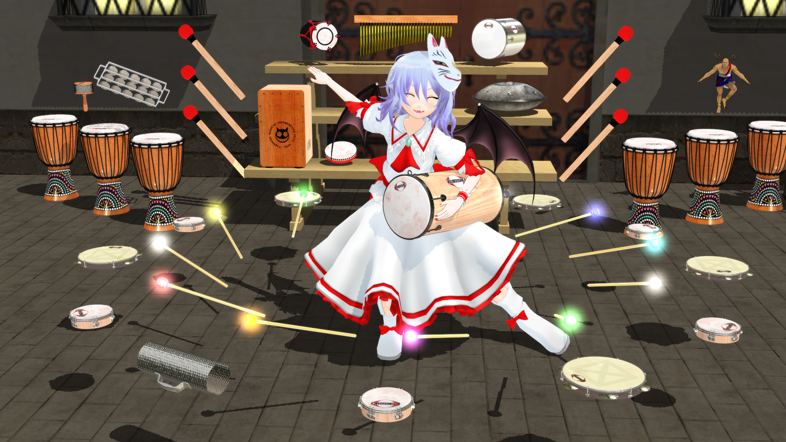

# MMD Models

## はじめに

このリポジトリは、Takosukeが制作したMMDモデルが保管されています。  
以下の注意事項をよく読んでご利用下さい。  

**また、現在は自作エクスポーターを使用してPMXファイルを出力しています**  
**データに不具合がある可能性がありますので、モデルの使用についてはご注意ください。**  

## 注意事項

* 本データを使用して発生したいかなる損害・損失・その他の不利益に対して当方は一切の責任を負いません。
* 本データは自己責任の元、御使用下さい。
* 無断でのデータの改造配布・再配布を禁止します。
* 著しく公序良俗に反する使用法や、気分を害す様な使用方法は禁止します。
* 公共良俗に反する利用を禁止します。
* 誹謗中傷目的，露骨な宗教・政治活動への利用を禁止します。
* 3Dプリンターでの出力を含め、無断での立体化を禁止します。
* 商用利用を禁止します。
* アダルトコンテンツへの利用を禁止します。
* 本規約と合わせ、各モデルに同梱のREADME.mdに記述した規約がモデルに対して適用されます。
* 規約の改定内容は、配布済みのモデルにも同様に適用されます。

以上の項目に対して違反があった場合は、  
予告なく、モデルデータの公開の停止、  
モデルデータ利用の禁止等の処理を行わせていただきます。

## 【重要】ニコニコでの使用について

GithubにあるMMD楽器をニコニコで使用する際は、
[im7046554](http://seiga.nicovideo.jp/seiga/im7046554)
をコンテンツツリー登録して下さい。  
ただ、クリエイター奨励プログラムを使用している訳ではないので、  
私に通知が届く方法であればツリー登録意外の方法でも問題ありません。  
(例：twitterでの通知など)

## ダウンロード

zipファイルは[Wiki](https://github.com/TakosukeGH/mmd_models/wiki)から
ダウンロード可能です。

## リンク一覧

- 個人HP : http://takosukegh.github.io/(移転作業中)
- twitter : <https://twitter.com/takosuke_tw>
- ニコニコ : <http://seiga.nicovideo.jp/user/illust/6106789>
- 質問箱 : <http://odaibako.net/u/takosuke_tw>

## 作成予定の楽器

- タンボリカ
- ハモンドオルガン

## その他のMMDモデルダウンロードリンク

- クラベス : <http://seiga.nicovideo.jp/seiga/im5104788>
- カバサ : <http://seiga.nicovideo.jp/seiga/im5113210>
- ツリーチャイム : <http://seiga.nicovideo.jp/seiga/im5114092>
- クロテイル : <http://seiga.nicovideo.jp/seiga/im5120046>
- ショカーリョ : <http://seiga.nicovideo.jp/seiga/im5154555
- タンバリン : <http://seiga.nicovideo.jp/seiga/im5238960>
- バウロン : <http://seiga.nicovideo.jp/seiga/im5239297>
- スタンド : <http://seiga.nicovideo.jp/seiga/im5243439>
- シロフォン : <http://seiga.nicovideo.jp/seiga/im5255505>
- グロッケンシュピール : <http://seiga.nicovideo.jp/seiga/im5260862>
- ヴィブラフォン : <http://seiga.nicovideo.jp/seiga/im5289536>
- マレット : <http://seiga.nicovideo.jp/seiga/im5663471>
- パーカッションセット : <http://seiga.nicovideo.jp/seiga/im5643433>

## 製作者情報

- 製作者名 : Takosuke
- 連絡先   : [@takosuke_tw](https://twitter.com/takosuke_tw)

