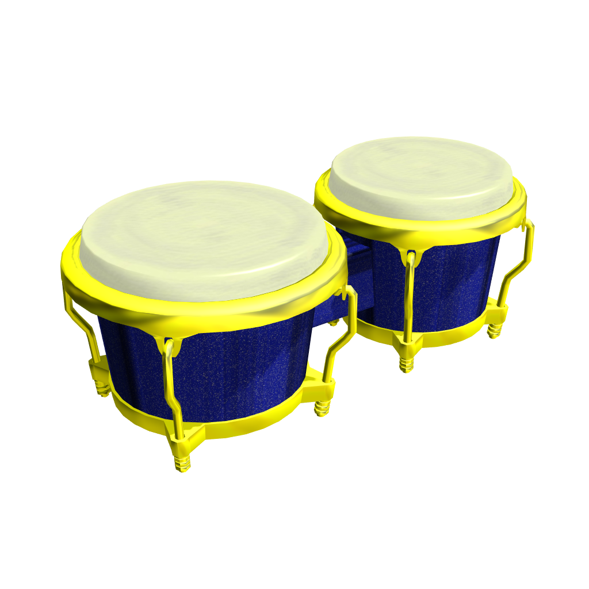

# MMD楽器モデル Bongos

## はじめに

本テキストファイルは、同梱したデータに関する情報・注意事項を記述したものです。
データの使用につきましては、このファイルの内容をよく確認した上で使用して下さい。  

## 注意事項

下記のリポジトリ直下のREADMEを必ず読んだうえでご使用下さい。

- <https://github.com/TakosukeGH/mmd_models/>

本モデルは、袖P様配布のマンボなボンゴを改変したものです。

<http://d.hatena.ne.jp/CaptainNoFuture/20101017/1287282078>

## ダウンロード

zipファイルのダウンロードはこちらから。

- <https://github.com/TakosukeGH/mmd_models/wiki>

## 使用ツール

| 名前         | Ver. |
|:-------------|:-----|
| Blender      | 2.79 |
| PMX exporter | 0.01 |
| MMD          | 9.26 |

## 製作者情報

- 製作者名 : Takosuke
- 連絡先   : [@takosuke_tw](https://twitter.com/takosuke_tw)

## リリースノート

- 2017/12/10 : 公開